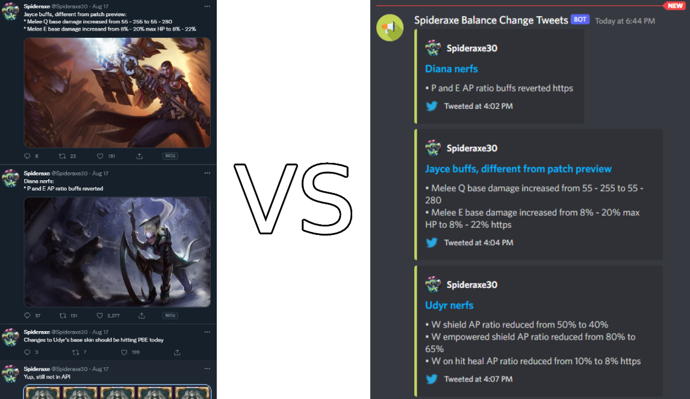

# Twitter Feed to Discord Webhook

My friends and I constantly check Spideraxe30's Twitter for upcoming League of Legends balance changes. Instead of having to keep checking manually every day, I created an AWS Lambda process to periodically check for and send all tweets related to balance changes to a channel in our private server.

1. [Example](#example)
2. [Requirements](#requirements)
3. [Installation](#installation--configuration)
4. [Deployment](#deployment) 

## Example

## Requirements
* [NodeJS](https://nodejs.org/en/)
* [AWS](https://aws.amazon.com/) account with [IAM](https://aws.amazon.com/iam/) permissions for [Lambda](https://aws.amazon.com/lambda/), [EventBridge](https://aws.amazon.com/eventbridge/), and [CloudWatch](https://aws.amazon.com/cloudwatch/)
* [AWS CLI](https://aws.amazon.com/cli/)

## Installation & Configuration
- Clone the repository
- Run `npm install` in the project
- Remove the `.EXAMPLE` extension from the `.env` file and set the variables with your data
- Modify the tweet data array filter and Discord embed creation

## Deployment
- [Deploy Node.js Lambda functions with .zip file archives](https://docs.aws.amazon.com/lambda/latest/dg/nodejs-package.html)
- [Schedule AWS Lambda Functions Using CloudWatch Events](https://docs.aws.amazon.com/AmazonCloudWatch/latest/events/RunLambdaSchedule.html)
